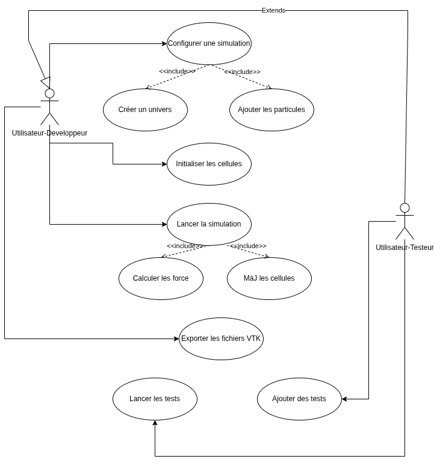
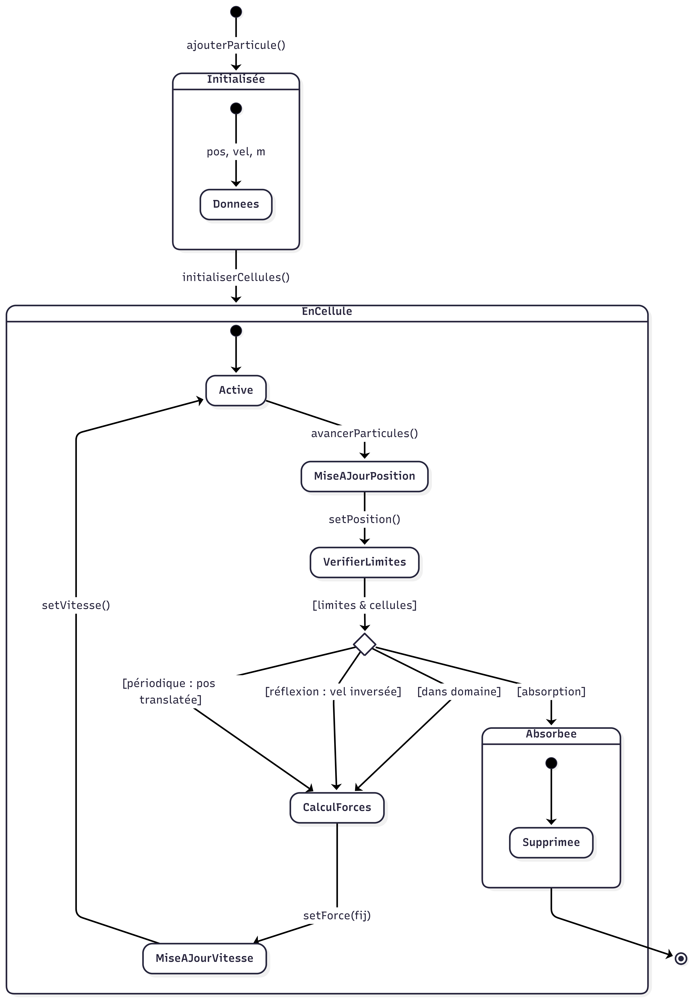

## Lab 5 : Test et visualisation


### Question 1 : Infrastructure de test

L'infrastructure utilise `Google Test` intégré via CMake.

Les tests couvrent trois niveaux de validation :

- Unitaire : chaque classe isolément, les constructeurs, opérateurs, cas limites (division par zéro, masse négative, auto-affectation)
- Comportementental : comportement de UniversLJ - nombre de cellules, affectation aux bonnes cellules, mise à jour après déplacement, conditions aux limites (absorption, réflexion, périodique)
- Physique : invariants de la simulation : force nulle au minimum, répulsion à courte distance, attraction à longue distance, 3ème loi de Newton, énergie cinétique correcte..

Résultat :

```
100% tests passed, 0 tests failed out of 77
Total Test time (real) = 0.15 sec
```

### Question 2 : Ajout de tests

Dans :

- `test/perf` : Tests de performances
- `test/*.cpp` : Tests unitaires utilisant GoogleTest
- `demo/` : Démo de collision de 1D, 2D et 3D simple et avancé (pour une bonne couverture de test)

### Question 3 : Visualisation VTK

`include/ExportVTK.hpp` définit deux fonctions :

- `saveVTK()` qui génère un fichier `output_XXXX.vtp` par pas de temps sauvegardé, contenant la position, la vitesse, la masse et la catégorie de chaque particule (la catégorie permet de colorer par type dans Paraview)
- `savePVD()` qui génère `simulation.pvd`, un fichier index qui regroupe tous les `.vtp` en une série temporelle

`simulation.pvd` ne contient pas les données, il référence uniquement les fichiers `output_*.vtp`.

Après avoir lancé la simulation depuis `./build` :

```bash
paraview simulation.pvd
```

### Question 4 : Diagramme des cas d'utilisation

- **Acteurs** : Utilisateur- Developpeur, Utilisateur-Testeur (+ hérite des cas d'utilisation de l'Utilisateur)
- **Cas d'utilisation** : Configurer une simulation (Créer un univers, ajouter des particules), Initialiser les cellules, Lancer la simulation (Calculer les forces, Mettre à jour les cellules en appliquant les conditions limites), Exporter les fichiers VTK ou CSV, Executer les tests, Ajouter des tests




### Question 5 : Diagramme de séquence

- Acteurs impliqués : Utilisateur | UniversLJ | Cellule | Particule | ExportVTK


### Question 6 : Diagramme Etats-Transitions

Le diagramme état-transition le plus pertinent est celui d'une `Particule`, vu que c'est l'objet dont l'état évolue au cours du temps.

Une particule est d'abord initialisée avec ses données physiques (position, vitesse, masse), puis affectée à une cellule du maillage. À chaque pas de temps, elle traverse une séquence d'états internes correspondant à l'intégrateur de Störmer-Verlet : mise à jour de la position, calcul des forces, puis mise à jour de la vitesse. En fin de pas, les conditions aux limites déterminent son devenir : elle reste active dans le domaine, est réfléchie, translatée périodiquement, ou définitivement supprimée par absorption.



### Question 7 : Diagramme de classe d'analyse
