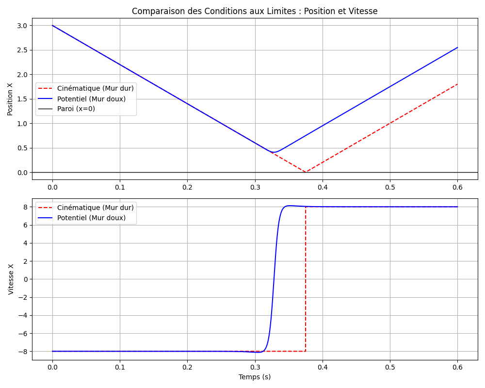

## Lab 6 : Raffinement du modèle et conditions aux limites

### Question 1 : Implémentation des conditions aux limites

Le code implémente trois types de conditions aux limites (de nature cinématique) dans la méthode `UniversLJ::appliquerConditionsLimites`, activées via un appel à `mettreAJourCellules(true)` :
- **Réflexion (`REFLEXION`)** : Lorsqu'une particule franchit une paroi, sa position est corrigée par rapport au mur franchi et la composante de sa vitesse perpendiculaire au mur est inversée.
- **Absorption (`ABSORPTION`)** : Utilisation de l'algorithme `std::remove_if` combiné à une lambda pour détecter et supprimer définitivement de la simulation (`particuleList.erase`) toute particule sortant du domaine.
- **Périodique (`PERIODIQUE`)** : Utilisation de l'opérateur modulo (`std::fmod`) pour transporter une particule sortant d'un bord directement sur le bord opposé du domaine, sans modifier sa trajectoire ou sa vitesse.

### Question 2 : Test des conditions aux limites

Ces différentes conditions font l'objet de tests unitaires dans `test/test_univers_tp4.cpp`

### Question 3 : Implémentation du potentiel de paroi

La condition réflexive a également été implémentée via un potentiel de paroi pour modéliser une vraie interaction physique (qu'on appelera apres : murs doux).
- L'activation se fait via le booléen `use_potentiel_reflexion` passé à la méthode `UniversLJ::calculerForces()`. Si activé, celle-ci appelle `appliquerForcesParoi()`.
- Pour chaque particule se trouvant à une distance $d < r_{cut}$ d'un mur, la méthode `calculerForceParoi(d)` évalue la force de répulsion dérivée du potentiel de Lennard-Jones et l'ajoute à la force totale exercée sur la particule.

### Question 4 : Comparaison des deux implémentations réflexives

La simulation comparative (`demo/demo_comparaison_murs.cpp`) permet d'observer l'impact de chaque méthode de réflexion. Le résultat est illustré ci-dessous :

- **Réflexion Cinématique (Mur dur, en rouge pointillé)** :
  - rebond géométrique abstrait.
  - La trajectoire percute exactement l'axe $x=0$ sous forme de V.
  - La vitesse s'inverse instantanément via une discontinuité mathématique (de $-8.0$ à $+8.0$).

- **Réflexion par Potentiel (Mur doux, en bleu)** :
  - rebond physique dynamique.
  - La particule ralentit progressivement sous l'effet de la force de paroi avant même d'atteindre le mur. Sa trajectoire est courbée.
